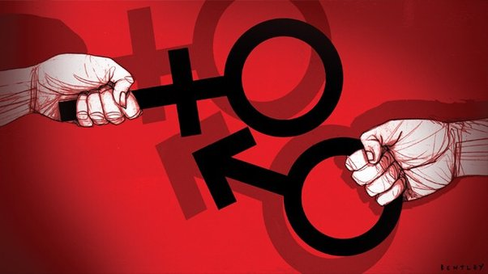

## Presidential/Congress Campaigns

[Gibson, K. L., & Heyse, A. L. (2010). “The difference between a hockey mom and a pit bull”: Sarah Palin's faux maternal persona and performance of hegemonic masculinity at the 2008 Republican National Convention. *Communication Quarterly*, 58(3), 235-256.](https://www.tandfonline.com/doi/abs/10.1080/01463373.2010.503151)

[Lee Kaid, L., Fernandes, J., & Painter, D. (2011). Effects of political advertising in the 2008 presidential campaign. *American Behavioral Scientist*, 55(4), 437-456.](https://journals.sagepub.com/doi/abs/10.1177/0002764211398071)

[Conroy, M., Joesten Martin, D., & Nalder, K. L. (2020). Gender, sex, and the role of stereotypes in evaluations of Hillary Clinton and the 2016 presidential candidates. *Journal of Women, Politics & Policy*, 41(2), 194-218.](https://www.tandfonline.com/doi/abs/10.1080/1554477X.2020.1731280)

[Bracic, A., Israel-Trummel, M., & Shortle, A. F. (2019). Is sexism for white people? Gender stereotypes, race, and the 2016 presidential election. *Political Behavior*, 41(2), 281-307.](https://idp.springer.com/authorize/casa)

## Political Advertising

[Hitchon, J. C., Chang, C., & Harris, R. (1997). Should women emote? Perceptual bias and opinion change in response to political ads for candidates of different genders. *Political Communication*, 14(1), 49-69.](https://www.tandfonline.com/doi/abs/10.1080/105846097199533)

[Searles, K., Fowler, E. F., Ridout, T. N., Strach, P., & Zuber, K. (2020). The effects of men’s and women’s voices in political advertising. *Journal of Political Marketing*, 19(3), 301-329.](https://www.tandfonline.com/doi/abs/10.1080/15377857.2017.1330723)

[Gordon, A., Shafie, D. M., & Crigler, A. N. (2003). Is negative advertising effective for female candidates? An experiment in voters' uses of gender stereotypes. *Harvard International Journal of Press/Politics*, 8(3), 35-53.](https://journals.sagepub.com/doi/abs/10.1177/1081180X03008003003)

## Cyberspace

[Evans, H. K., Ovalle, J., & Green, S. (2016). Rockin'robins: Do congresswomen rule the roost in the Twittersphere?. *Journal of the Association for Information Science and Technology*, 67(2), 268-275.](https://asistdl.onlinelibrary.wiley.com/doi/abs/10.1002/asi.23383)

[McGregor, S. C. (2018). Personalization, social media, and voting: Effects of candidate self-personalization on vote intention. *New media & society*, 20(3), 1139-1160.](https://journals.sagepub.com/doi/abs/10.1177/1461444816686103)

[Colliander, J., Marder, B., Falkman, L. L., Madestam, J., Modig, E., & Sagfossen, S. (2017). The social media balancing act: Testing the use of a balanced self-presentation strategy for politicians using twitter. *Computers in Human Behavior*, 74, 277-285.](https://www.sciencedirect.com/science/article/pii/S0747563217302844)

[Mattan, A. J., & Small, T. A. (2021). Worth a Thousand Words: The Study of Visual Gendered Self-Presentation on Twitter. *Canadian Journal of Political Science/Revue canadienne de science politique*, 54(2), 477-490.](https://www.cambridge.org/core/journals/canadian-journal-of-political-science-revue-canadienne-de-science-politique/article/worth-a-thousand-words-the-study-of-visual-gendered-selfpresentation-on-twitter/DCB5393AB04E1DB3D4DB1A897F578384)

## Media Coverage

[Bligh, M. C., Schlehofer, M. M., Casad, B. J., & Gaffney, A. M. (2012). Competent enough, but would you vote for her? Gender stereotypes and media influences on perceptions of women politicians. *Journal of Applied Social Psychology*, 42(3), 560-597.](https://onlinelibrary.wiley.com/doi/full/10.1111/j.1559-1816.2011.00781.x)

[Aaldering, L., & Van Der Pas, D. J. (2020). Political leadership in the media: Gender bias in leader stereotypes during campaign and routine times. *British Journal of Political Science*, 50(3), 911-931.](https://www.cambridge.org/core/journals/british-journal-of-political-science/article/political-leadership-in-the-media-gender-bias-in-leader-stereotypes-during-campaign-and-routine-times/B197672D2B8A6BCB0A65920396151699)

## Masculinity, Masculine Discourse and Femininity

[Cavazza, N., & Pacilli, M. G. (2021). Is politics still a masculine thing? Stereotypical male description activates the prototype of the politically committed individual worthy of a vote. *Sexuality & Culture*, 25(3), 1076-1095.](https://link.springer.com/article/10.1007/s12119-020-09810-9)

[Coe, K., Domke, D., Bagley, M. M., Cunningham, S., & Van Leuven, N. (2007). Masculinity as political strategy: George W. Bush, the “war on terrorism,” and an echoing press. *Journal of Women, Politics & Policy*, 29(1), 31-55.](https://www.tandfonline.com/doi/abs/10.1300/J501v29n01_03)

[Smith, J. C. (2021). Masculinity and femininity in media representations of party leadership candidates: men ‘play the gender card’too. *British Politics*, 1-22.](https://link.springer.com/article/10.1057/s41293-021-00172-w)

## Stereotypes and Prejudices/Bias

[Schwartz, J. A., & Blair, C. W. (2020). Do women make more credible threats? Gender stereotypes, audience costs, and crisis bargaining. *International Organization*, 74(4), 872-895.](https://www.cambridge.org/core/journals/international-organization/article/do-women-make-more-credible-threats-gender-stereotypes-audience-costs-and-crisis-bargaining/C9CD73BBADA998376C1AD9C4E009600E)

[Corbett, C., Voelkel, J. G., Cooper, M., & Willer, R. (2022). Pragmatic bias impedes women’s access to political leadership. *Proceedings of the National Academy of Sciences*, 119(6), e2112616119.](https://www.pnas.org/doi/abs/10.1073/pnas.2112616119)

[Åström, J., & Karlsson, M. (2016). The feminine style, the male influence, and the paradox of gendered political blogspace. *Information, Communication & Society*, 19(11), 1636-1652.](https://www.tandfonline.com/doi/abs/10.1080/1369118X.2016.1154088)

## TV Debates

[Orbegozo-Terradillos, J., Larrondo-Ureta, A., & Morales-i-Gras, J. (2020). Influence of gender in electoral debates in Spain: Analysis of the social audience in# ElDebateDecisivo and# L6Neldebate. *PROFESIONAL DE LA INFORMACION*, 29(2).](https://revista.profesionaldelainformacion.com/index.php/EPI/article/view/epi.2020.mar.09)

[Grebelsky-Lichtman, T., & Katz, R. (2019). When a man debates a woman: Trump vs. Clinton in the first mixed gender presidential debates. *Journal of Gender Studies*, 28(6), 699-719.](https://www.tandfonline.com/doi/abs/10.1080/09589236.2019.1566890)

## Other

[Saha, S., & Weeks, A. C. (2020). Ambitious women: Gender and voter perceptions of candidate ambition. *Political Behavior*, 1-27.](https://idp.springer.com/authorize/casa)

[Grebelsky-Lichtman, T., & Katz, R. (2020). Gender Effect on Political Leaders’ Nonverbal Communicative Structure during the COVID-19 Crisis. *International Journal of Environmental Research and Public Health*, 17(21), 7789.](https://www.mdpi.com/868266)

[Maier, J., & Renner, A. M. (2018). When a man meets a woman: Comparing the use of negativity of male candidates in single-and mixed-gender televised debates. *Political Communication*, 35(3), 433-449.](https://www.tandfonline.com/doi/abs/10.1080/10584609.2017.1411998)

[Cavazza, N. (2016). When political candidates “go positive”: The effects of flattering the rival in political communication. *Social Influence*, 11(3), 166-176.](https://www.tandfonline.com/doi/abs/10.1080/15534510.2016.1206962)

[Bast, J., Oschatz, C., & Renner, A. M. (2022). Successfully Overcoming the “Double Bind”? A Mixed-Method Analysis of the Self-Presentation of Female Right-wing Populists on Instagram and the Impact on Voter Attitudes. *Political Communication*, 1-25.](https://www.tandfonline.com/doi/abs/10.1080/10584609.2021.2007190)

  
